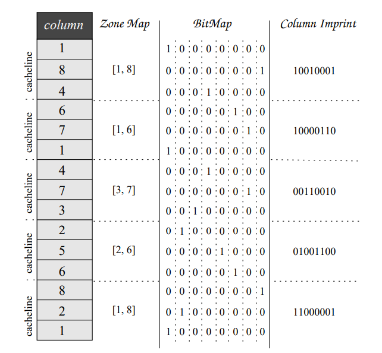
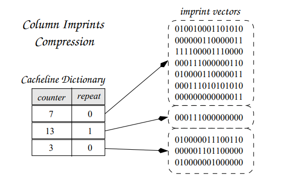
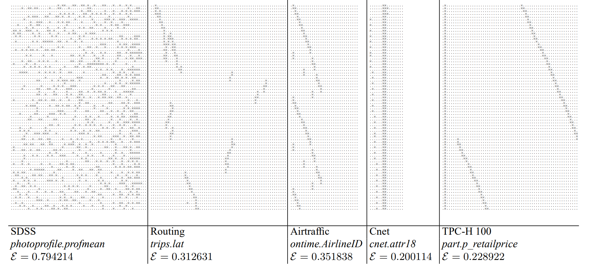
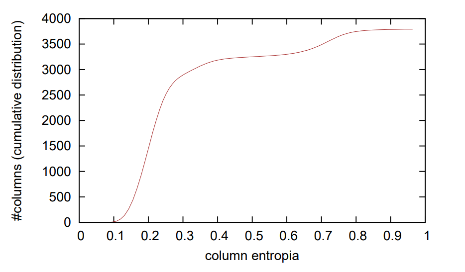
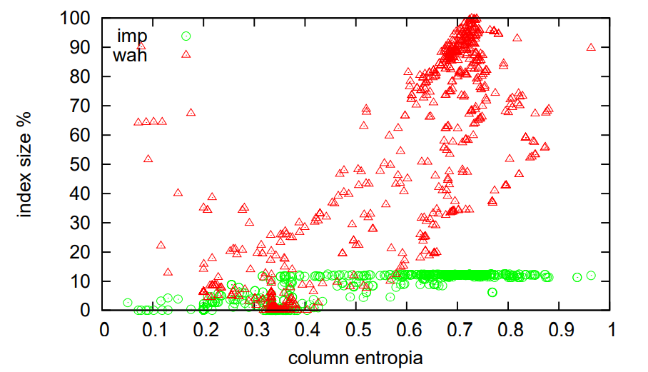
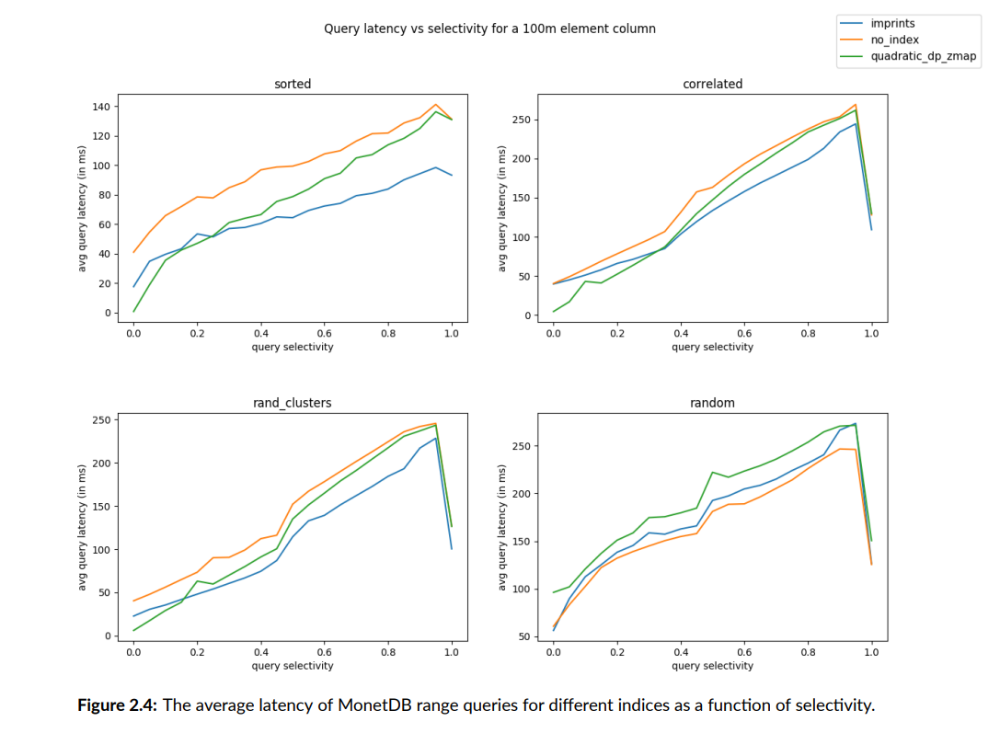
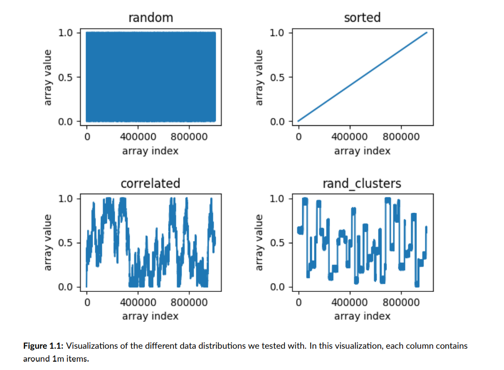
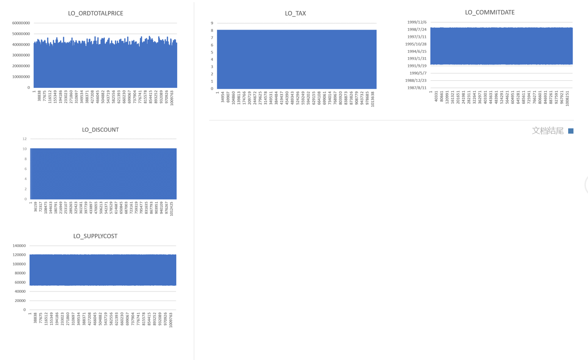

# Column Imprints

## 概述

Column imprints是一种次级索引，可以在查询时进行过滤，减少IO，加快查询。

## 基本概念

Column imprints会把一个column分成很多个等长的cacheline。一个每个cacheline对应一个imprint。Imprint里的每个bit对应一个直方图里的bucket，
统计cachline里是否有元素落到这个bucket里。如果有，就置1，如果没有就置0。

1. imprint的长度

    一般imprint的长度是64bit，这样的长度可以适应64位的处理器。经过改进，imprint的长度可以增加到512bit。
  
2. cacheline的长度
  
    一般一个cacheline的大小是imprint的8倍。例如一个存int32的column，用64位的imprint统计，理想的cacheline大小是16行。
    如果增大cacheline的大小，可以节省索引的存储空间，但是会导致查询时假阳性增加。

## Create

### 步骤

1. 确定直方图每个bucket的范围: 

   1.1 采样2048个元素，删减去重复的元素。得到数组sample，记录剩下的元素的值。

   1.2 计算每个bucket的范围

    如果剩下的元素个数小于62个（第1个和第64个bucket分别用来统计小于采样出最小值和大于采样中的最大值的元素），每个bucket里就只有一个数值，
    多余的bucket用coltype_MAX填充。如果元素个数特别少，会使用32位，16位，8位大小的imprint。
    如果元素个数大于62个，每个bucket的覆盖sample数值个数为step=len(sample)/62。

2. 遍历column计算每个cacheline的imprint:

   2.1 根据元素的值对应的bucket。

   2.2 在imprint中，把bucket对应的bit置1。

### 时间复杂度

column imprint建立的时间复杂度是线性的。最大的开销在于确定元素对应的bucket。
用monetdb做实验，一亿行数据（ssb中lineorder表）生成索引需要约5s。

## 存储空间

连续相同的imprint会被压缩成一个值存储。但是对大多数数据，压缩的效果不明显。

column imprints索引所占空间一般为column大小的1/8。

### 存储空间实验 (Column Imprints: A Secondary Index Structure)

* entropia):

* 实验数据分布：

* 实验中index占存储空间的大小：

## Update

如果新增的元素都append在column末尾，更新column imprints只需重新计算最后一个cacheline。
monetdb不支持自动更新，在列插入新数据后，索引会失效。

## Query

### 步骤

1. 根据查询语句和直方图计算出mask和innermask

   mask是完全覆盖查询的最小imprint vector。例如，直方图的边界是(-∞,1),[1,4),[4,8),[8,∞)，查询是[2，9)，mask就会是0111，即[1,∞)。mask的
   作用是筛选出可能符合查询要求的cachline。

   innermask是被查询完全覆盖的最大imprint vector。在上面的例子中，innermask就会是0010，即[4,8)。innermask的作用是筛选出所有元素都符合查询
   的cachline，这些cacheline不用遍历元素排除假阳性。

2. 遍历索引中的imprint。

   如果不满足mask的要求，则跳过整个cacheline。
   如果满足mask但是不满足innermask，则遍历cacheline，对每个元素判断是否符合查询，选中符合的元素。
   如果满足innermask，选中整个cacheline。

Query中最大的时间开销在于排除假阳性，即遍历那些满足mask但是不满足innermask的cacheline。

### Query Latency 实验 (Zone Map Layout Optimization)

* 当column的分布有cluster的时候，column imprints的表现比较好。

* 实验中的数据分布：

* ssb中lineorder表中除了主键和String类型的数据分布：

